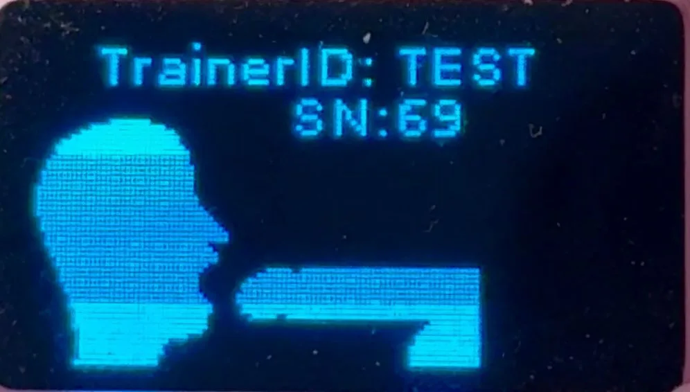

<Note>
Before you start, make sure your trainer is charged and that you can sign in to your dashboard account. For live syncing and remote features, connect your trainer to Wi‑Fi after pairing. See <a href="/dtt/quick-start/pairing/wifi-setup">Connect your trainer to Wi‑Fi</a>.
</Note>

## Video walkthrough

Watch AJ demonstrate the complete pairing process step-by-step.

<iframe
  className="w-full aspect-video rounded-xl"
  src="https://www.loom.com/embed/0693801a3d084bb6b28255debbeeb20e"
  title="How to pair your Deepthroat Trainer"
  frameBorder="0"
  allow="accelerometer; autoplay; clipboard-write; encrypted-media; gyroscope; picture-in-picture"
  allowFullScreen
></iframe>

<AccordionGroup>
<Accordion title="Video transcript">
**0:00** Hi there! Today I’ll show you how to find your Trainer ID so you can pair your Deepthroat Trainer to the dashboard.

**0:08** I have a fully charged Deepthroat Trainer here. I’m going to turn it on—during boot you’ll see “Trainer ID: TEST” at the top center.

**0:18** “TEST” is the Trainer ID for my demo device. Your device will show a random 5–6 character alphanumeric code—write it down for later.

**0:32** If you forget it, just power the device off and back on. The Trainer ID appears again during startup.

**0:38** I’ll take that code into the dashboard and enter it under Settings → Devices.

**0:51** You can do this on mobile or desktop. I’ll enter my demo code in the “Deepthroat Trainer ID” field.

**0:59** You’ll have your own randomized code. I’ll click “Pair Device.” Perfect—my device is paired.
</Accordion>
</AccordionGroup>

## Pairing steps

<Steps>
<Step title="Power on your trainer">
  Turn on your device. During startup, the screen shows your Trainer ID at the top center.

  <Check>
  Outcome: The display briefly shows “Trainer ID: XXXXX”.
  </Check>
</Step>

<Step title="Find your Trainer ID">
  Look for “Trainer ID: XXXXX” on the screen. Write down this 5–6 character alphanumeric code exactly as it appears (case‑sensitive, no spaces).

  <Frame caption="Example Trainer ID on the device screen">
    
  </Frame>
</Step>

<Step title="Open the dashboard">
  Navigate to https://dashboard.researchanddesire.com/ and sign in to your account.

  <Check>
  Outcome: You’re signed in and can access Settings.
  </Check>
</Step>

<Step title="Enter your Trainer ID">
  Go to **Settings → Devices**, find the “Deepthroat Trainer ID” field, and enter your code exactly as shown on your device.

  <Tip>
  Common mistakes: using lowercase instead of uppercase, adding spaces, or entering a Wi‑Fi password instead of the Trainer ID.
  </Tip>
</Step>

<Step title="Complete pairing">
  Click **Pair Device**.

  <Check>
  Outcome: You see a success confirmation and your trainer appears in your Devices list.
  </Check>
</Step>
</Steps>

<Info>
Want live syncing and remote features? After pairing, connect your trainer to Wi‑Fi: <a href="/dtt/quick-start/pairing/wifi-setup">Connect your trainer to Wi‑Fi</a>.
</Info>

<Warning>
Transferring a previously paired device? The current owner must unpair it from their account before you can pair it. For how ownership is determined and transfers are handled, see <a href="https://dashboard.researchanddesire.com/faqs/device-ownership-dispute-policy">Device ownership policy</a>.
</Warning>

## Troubleshooting

<AccordionGroup>
<Accordion title="Forgot your Trainer ID?">
Turn the device off, then back on—the Trainer ID displays again during startup.
</Accordion>

<Accordion title="Entered the wrong code?">
Make sure you’re entering the exact Trainer ID from the boot screen. It’s 5–6 characters, case‑sensitive, with no spaces. Don’t use your Wi‑Fi SSID or password here.
</Accordion>

<Accordion title="Device already paired to another account?">
Ask the current owner to unpair it from their account. If you can’t reach them, review the <a href="https://dashboard.researchanddesire.com/faqs/device-ownership-dispute-policy">ownership policy</a> and contact support for assistance.
</Accordion>

<Accordion title="Still need help?">
Contact support via the dashboard or our website. Include your Trainer ID and a screenshot of any error message to speed up resolution.
</Accordion>
</AccordionGroup>
