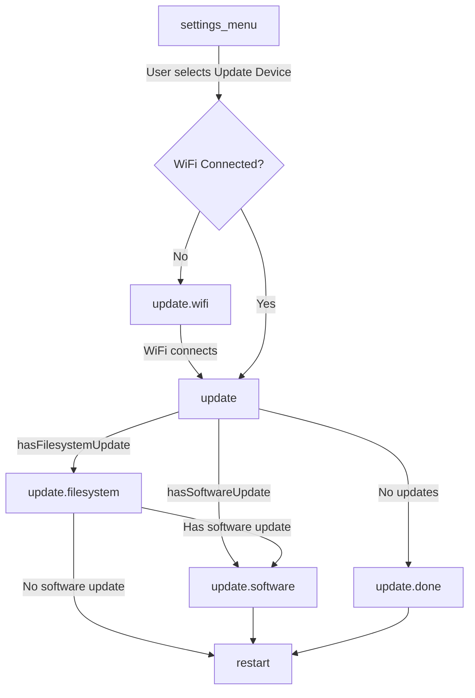

This document describes the over-the-air (OTA) update system used by the Research And Desire wireless Remote (RADR), including the update chain, state machine flow, and what components get updated.

## Overview

RADR uses a two-part OTA update system:

| Component | Description | Binary |
|-----------|-------------|--------|
| **Firmware** | ESP32 application binary | `firmware.bin` |
| **Filesystem** | LittleFS partition containing device registry and protocol specs | `littlefs.bin` |

The filesystem update is particularly important for device support — it contains the Buttplug.io registry that maps Bluetooth service UUIDs to device configurations. This allows adding support for new devices without requiring firmware changes.

## Update Architecture

```mermaid
flowchart TB
    subgraph OTA[OTA Update System]
        direction LR
        subgraph FW[Firmware Update]
            FWBin[firmware.bin]
            FWBin --> AppCode[Application Code]
        end
        subgraph FS[Filesystem Update]
            FSBin[littlefs.bin]
            FSBin --> Registry[/registry.json]
            FSBin --> Protocols[/protocols/*.json]
            Protocols --> ButtplugSpecs[Buttplug.io Device Specs]
        end
    end
    Server[Supabase Storage] --> OTA
```

### Update Server

Updates are served from Supabase Storage. The server URL is defined in `platformio.ini`:

```ini
UPDATE_SERVER_URL="https://acjajruwevyyatztbkdf.supabase.co/storage/v1/object/public/radr-firmware"
```

Binary URLs follow the pattern:
- Firmware: `{UPDATE_SERVER_URL}/master/firmware.bin`
- Filesystem: `{UPDATE_SERVER_URL}/master/littlefs.bin`

## State Machine Flow

Updates are managed by the RADR state machine. The update flow is triggered from the Settings menu.



### State Transitions

| From | To | Condition |
|------|-----|-----------|
| `settings_menu` | `update` | User selects "Update Device" + WiFi connected |
| `settings_menu` | `update.wifi` | User selects "Update Device" + WiFi not connected |
| `update.wifi` | `update` | WiFi connection established |
| `update` | `update.filesystem` | `hasFilesystemUpdate` guard returns true |
| `update` | `update.software` | `hasSoftwareUpdate` guard returns true (no filesystem update) |
| `update` | `update.done` | No updates available |
| `update.filesystem` | `update.software` | Filesystem update complete + software update available |
| `update.filesystem` | `restart` | Filesystem update complete, no software update |
| `update.software` | `restart` | Software update complete (always restarts) |
| `update.done` | `restart` | User acknowledges |

## What Gets Updated

### Firmware Update

The firmware update replaces the ESP32 application binary. This includes:

- Core application logic
- UI and display code
- Bluetooth stack and device communication
- State machine and navigation
- Input handling (encoders, buttons, bumpers)

**Implementation:** `updateSoftwareTask()` in `src/tasks/update.cpp`

```cpp
void updateSoftwareTask(void *pvParameters) {
    // Uses ESP32 HTTPUpdate library
    httpUpdate.setRebootOnUpdate(true);  // Auto-reboot on success
    
    String url = String(UPDATE_SERVER_URL) + "/master/firmware.bin";
    httpUpdate.update(client, url);
}
```

The firmware update automatically reboots the device on success.

### Filesystem Update

The filesystem update replaces the LittleFS partition, which contains:

| File | Purpose |
|------|---------|
| `/registry.json` | Maps BLE service UUIDs to protocol spec files |
| `/protocols/*.json` | Buttplug.io v4 device configuration files |

**Implementation:** `updateFilesystemTask()` in `src/tasks/update.cpp`

```cpp
void updateFilesystemTask(void *pvParameters) {
    LittleFS.end();  // Unmount before update
    
    httpUpdate.setRebootOnUpdate(false);  // Don't reboot yet
    
    String url = String(UPDATE_SERVER_URL) + "/master/littlefs.bin";
    httpUpdate.updateSpiffs(client, url);
    
    LittleFS.begin();  // Remount after update
}
```

<Info>
The filesystem update does not trigger an automatic reboot. This allows both filesystem and firmware to be updated in sequence before restarting.
</Info>

### Registry Update Chain

When the filesystem is updated, the Buttplug.io device registry is refreshed:


The registry is loaded at boot time by `initRegistry()` in `src/devices/registry.cpp`:

1. Hardcoded devices are registered first (e.g., OSSM)
2. `/registry.json` is read from LittleFS
3. Each service UUID is mapped to a `ButtplugIODeviceFactory`
4. Protocol specs are loaded on-demand when devices are discovered

## Update Availability

Update availability is determined by guard functions in `src/state/guards.hpp`:

```cpp
bool hasFilesystemUpdate(const State &state, const Event &event) {
    return isFilesystemUpdateAvailable;
}

bool hasSoftwareUpdate(const State &state, const Event &event) {
    return isSoftwareUpdateAvailable;
}
```

These flags are controlled by:

| Flag | Set When |
|------|----------|
| `isSoftwareUpdateAvailable` | `FORCE_UPDATE` compile flag, or server indicates update |
| `isFilesystemUpdateAvailable` | `FORCE_UPDATE` compile flag, or server indicates update |

<Warning>
The current implementation has a TODO for automatic update checking. Currently, updates are triggered manually and availability must be set via compile flags or external mechanisms.
</Warning>

## Key Source Files

| File | Purpose |
|------|---------|
| `src/tasks/update.cpp` | Update task implementations (`updateSoftwareTask`, `updateFilesystemTask`) |
| `src/tasks/update.h` | Update task declarations and availability flags |
| `src/state/machine.h` | State machine definition with update states |
| `src/state/guards.hpp` | Guard functions for update availability |
| `src/devices/registry.cpp` | Registry initialization from LittleFS |
| `data/registry.json` | Service UUID to protocol spec mappings |
| `data/protocols/*.json` | Buttplug.io v4 device specifications |

## Development Notes

### Forcing Updates

For development and testing, use the `FORCE_UPDATE` compile flag:

```ini
build_flags =
    -D FORCE_UPDATE
```

This sets both `isSoftwareUpdateAvailable` and `isFilesystemUpdateAvailable` to `true`.

### Local Filesystem Updates

When developing locally, use PlatformIO's "Upload Filesystem" feature:

```bash
pio run --target uploadfs
```

This uploads the contents of the `data/` directory to the LittleFS partition.

<Warning>
"Upload Filesystem" erases the existing LittleFS partition before writing. Any runtime modifications will be lost.
</Warning>

## Related Documentation

<CardGroup cols={2}>
<Card title="Device Registry" icon="database" href="/radr/Software/device-registry/introduction">
How RADR discovers and creates device instances from BLE service UUIDs.
</Card>

<Card title="Web Flasher" icon="bolt" href="/radr/tools/web-flasher">
Manual firmware flashing via browser.
</Card>
</CardGroup>
