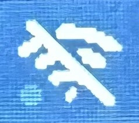
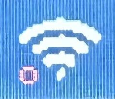

# Wi-Fi Trouble Shooting

If you are having trouble connecting your Chastity Lockbox or Deepthroat Trainer to WiFi, follow the steps below:

### Notes:

1. **IMPORTANT:** R+D Devices require a **2.4GHz network** and will not work with a 5GHz connection!&#x20;
2. Try the "Troubleshooting Steps" below while placing the device right beside your router. This will help you rule out the issue of a weak WiFi signal!

### Lockbox WiFi Symbols

The WiFi connection on the Chastity Lockbox is depicted through a Wifi network icon, and a coloured circle to the left of it. Use the following legend to help you narrow down the issue:

<figure><figcaption></figcaption></figure>

* **WiFi icon OFF**
  * Device is definitively not connected to WiFi
* **WiFi icon ON**
  * If the WiFi icon does **not** have a line through it, it may be connected. Refer to the coloured circle for additional context.

<figure><figcaption></figcaption></figure>

* **WiFi ON +&#x20;**_**red**_**&#x20;circle**
  * WiFi connected but unable to reach the Internet or dashboard. In other words, no websites are loading.

<figure><figcaption></figcaption></figure>

* **WiFi ON +&#x20;**_**yellow**_**&#x20;circle**
  * Successfully online, but not yet logged in to the dashboard. If the yellow circle is flashing, give it some time to connect; If it is still not resolved, move on to the troubleshooting steps below.

<figure><figcaption></figcaption></figure>

* **WiFi ON +&#x20;**_**green**_**&#x20;circle**
  * Fully connected and logged into the dashboard.

If your device is not fully connected, move on to the troubleshooting steps below.

### Troubleshooting Steps:

1. Restart your router and connect your Chastity Lockbox/Deepthroat Trainer to a 2.4GHz WiFi connection
2. Check that your WiFi network password is correct by connecting with another device
3. Verify that your WiFi connection is functioning for devices other than your Chastity Lockbox/Deepthroat Trainer
4. If possible, connect your Chastity Lockbox/Deepthroat Trainer to a separate WiFi network, such as a hotspot, to check if it is a device or network issue

If your WiFi connection issue persists after troubleshooting, please contact the support team.


