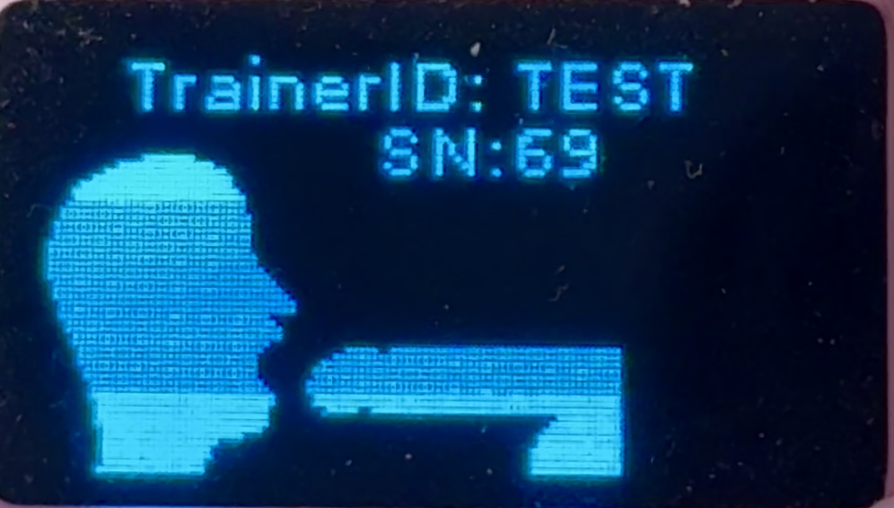

# Step 2: Pair your Deepthroat Trainer to your account


AJ show you, step-by-step, how to pair your Deepthroat Trainer to the Dashboard


Video Transcript

0:00 Hi there. Today I'm going to show you how to find your trainer ID so you can pair your Deepthroat trainer to the dashboard.\
0:08 I have a Deepthroat trainer here on the table that's fully charged. I'm going to turn it on, and on boot, in the top middle you'll see trainer ID colon T-E-S-T.\
0:18 Now, test is the trainer ID for my device, but you're going to see a random code that's five characters long with numbers and you'll want to write that down or memorize it for later use.\
0:32 If you forget it, you can just turn your device off and then back on again just like this, and you'll see it here at the top.\
0:38 T-E-S-T for me, and a code for we're going to take that code into the dashboard, and we're going to enter it on Settings, Devices.\
0:51 This can be done on mobile or on desktop. Here, I'll see the field for DeepthroatTrainer ID, and I'll enter T-E-S-T 1.\
0:59 You'll have a five-digit code that's randomized, and I'll pair device. Perfect. Perfect. My device is paired.

### Steps for Pairing




#### Step 1: Power On Your Trainer

Make sure your battery is charged, then turn on your device. The trainer ID will appear on screen during boot.




#### Step 2: Find Your Trainer ID

Look at the display - you'll see "Trainer ID: XXXXX" in the top middle. Write down this 5 or 6-character code! Here's an example image of a Tainer ID:

<figure><figcaption>
Example TrainerID
</figcaption></figure>




#### Step 3: Go to Dashboard

Open [dashboard.researchanddesire.com](https://dashboard.researchanddesire.com/) and sign in to your account.




#### Step 4: Enter Your Trainer ID

Go to Settings → Devices, find the "Deepthroat Trainer ID" field, and enter your code exactly as shown.




#### Step 5: Pair Device

Click "Pair Device" and you're done! Your trainer is now connected to your account.




If you want to transfer ownership of an already paired device, please have the original owner unpair it from their account before following these steps.&#x20;


### Need Help?

- **Forgot your trainer ID?** Just turn your device off and back on - it'll show again
- **Wrong code?** Make sure you're entering the trainer ID (not Wi-Fi password)
- **Already paired?** Contact support to transfer ownership
