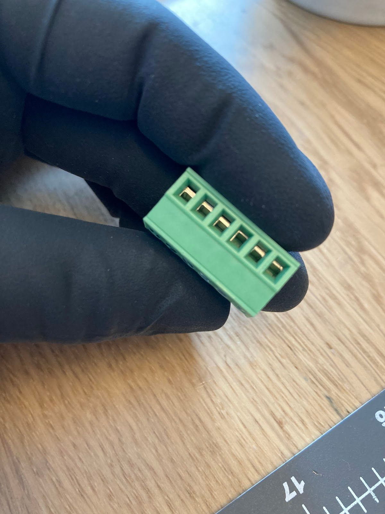
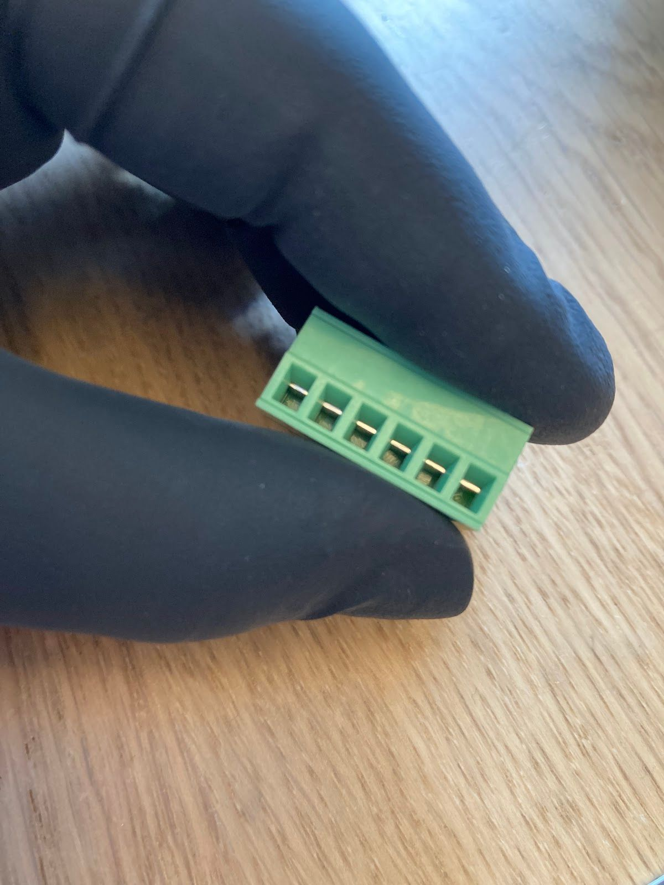
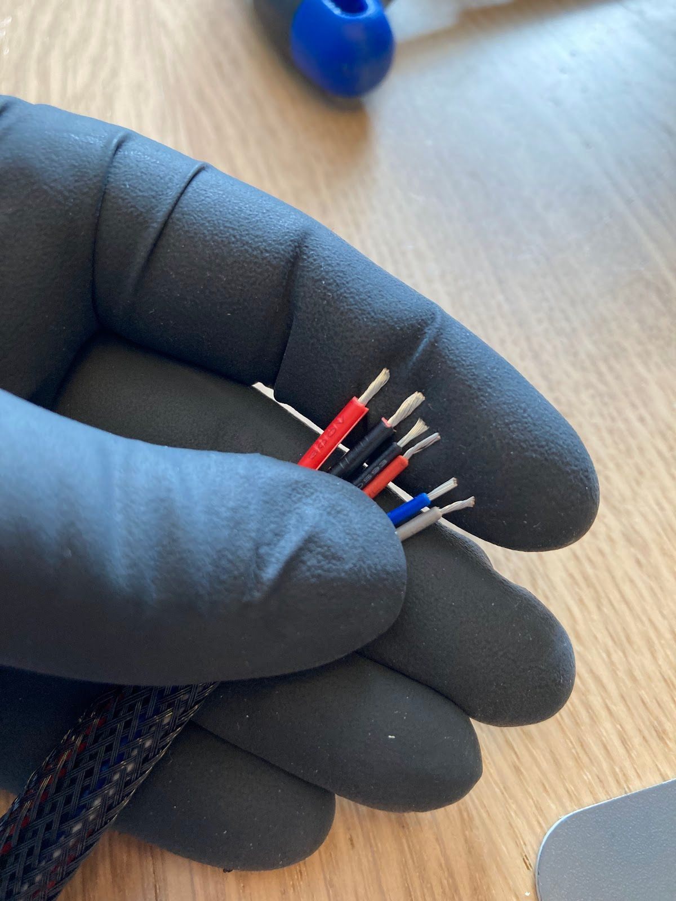
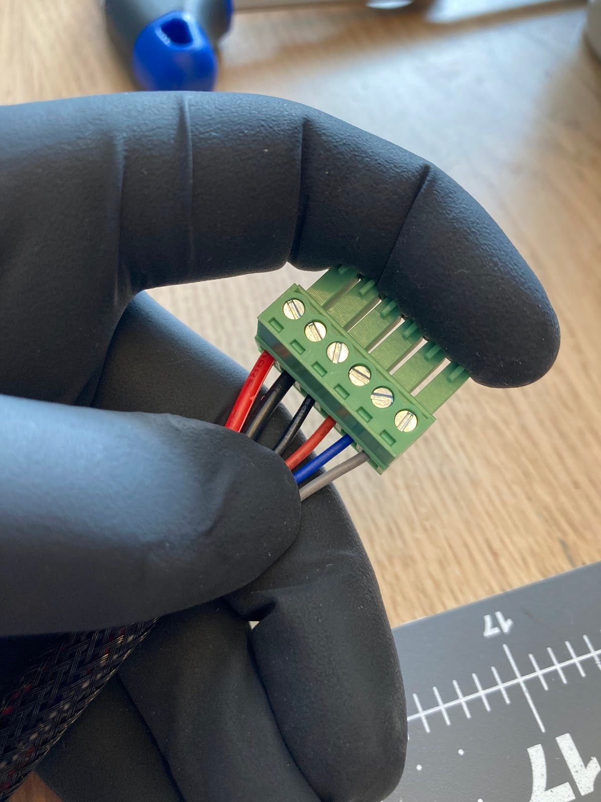
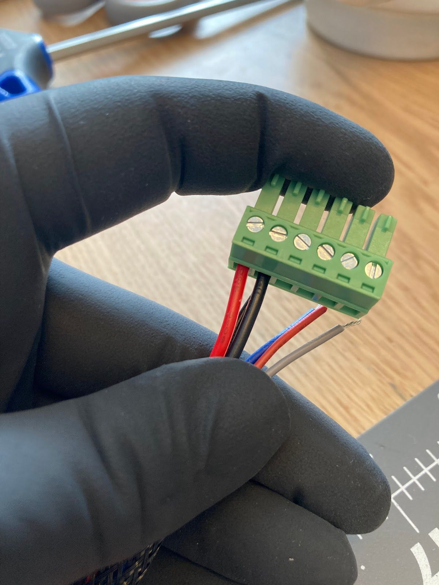
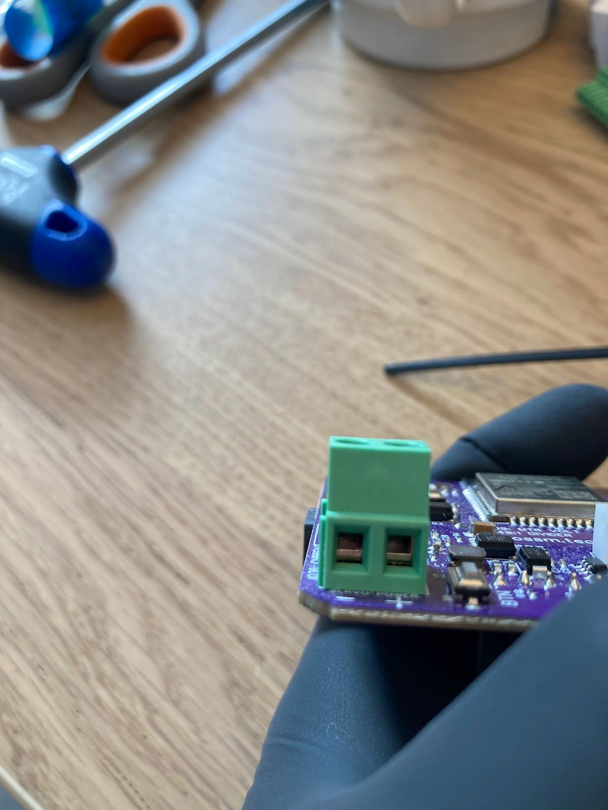
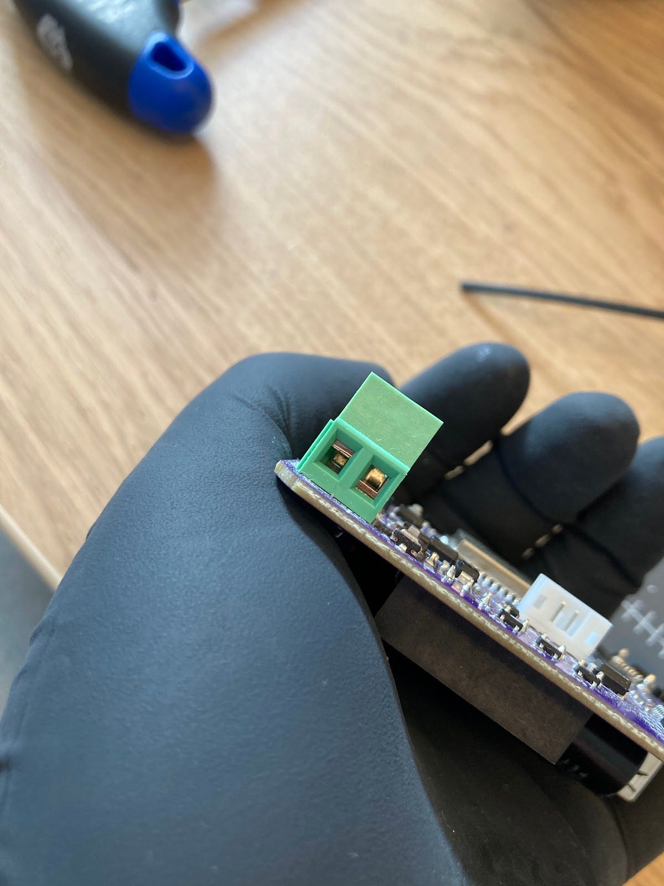
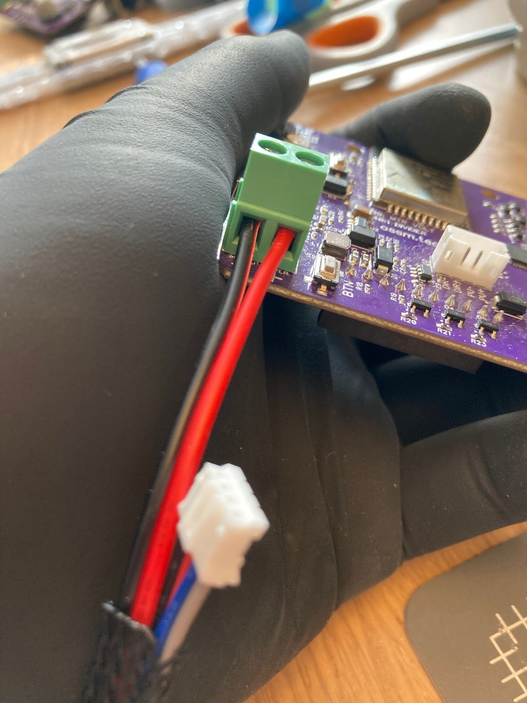
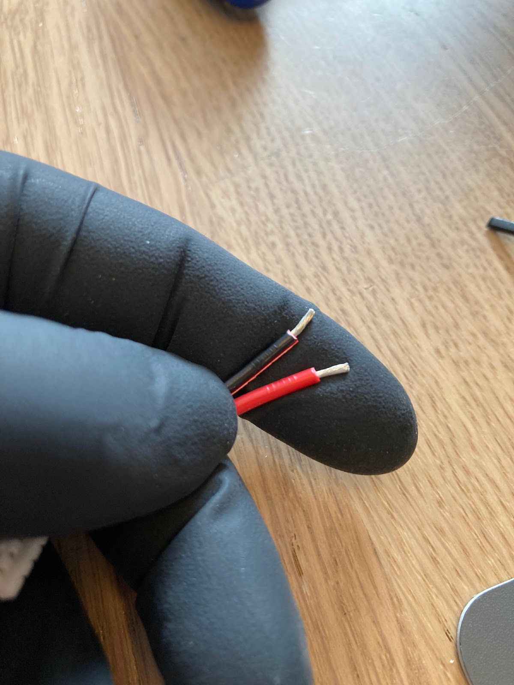

# Wiring Your Gold Motor

A handy guide to correctly wiring your OSSM Gold Motor (57AIM30).

If you purchase a motor from R+D, you will receive a kit with all the necessary wires.

You will need:

- Small flat head screwdriver
- Wire strippers
- Snippers
- Green connector (included)
- PH04 Cable (included)
- 250mm Power cable (included)
- Wiring Sleeve (optional)

Start by opening all the terminals in your green connector using your screwdriver.

<figure><figcaption></figcaption></figure> <figure><figcaption></figcaption></figure>

<figure><figcaption></figcaption></figure>

Your connector will arrive with terminals in the “closed position” (Fig 1.)

Next, you will want to line up your wires to keep them in the correct order. You will need to snip apart the power cable wires and strip the ends of all the wires to be a couple mm long (or about ⅛”)

You will want to have your power cable first and then your PH04 Cable. The order, starting with the power cable, should be red, black, black, red, blue, grey (if you wish to use a wiring sleeve, you will want to fit the wires through before stripping!)

Insert the power cables (red, black) into the first two terminals as shown. Make sure your screws are on the top of the connector. Use your screwdriver to tighten the terminals. You will want these to be as tight as you can go!

<figure><figcaption></figcaption></figure> <figure><figcaption></figcaption></figure>

Insert the PH04 cables into the terminals and tighten all the way!

You have now finished your connector end!

Time to open the terminals on the OSSM PCB!

<figure><figcaption></figcaption></figure> <figure><figcaption></figcaption></figure>

(Fig 6.) Your board will arrive with the terminals closed. Here, the terminal on the left is closed, but the one on the right is open to show the difference.

Strip the other end of your power cable and snip apart

<figure><figcaption></figcaption></figure> <figure><figcaption></figcaption></figure>

It helps to twist these wires so that the ends stay together and do not splay out.

Once you have slid the black wire into the “-” terminal and red wire into the “+” terminal, you can tighten down the screws as tight as they’ll go!

Plug the white end connector seen here into the white connector on the board and your wiring will be done!

Plug the green connector into the corresponding green terminal on the motor and plug your 24V power supply into the board. Your motor should show a green light on the base indicating it has power, and the motor shaft should start rotating.

_If you have your OSSM remote plugged into your board at the same time, you will notice that the device will be unable to home. This is NORMAL! You will need your OSSM to be fully built with a rail for homing to complete._
